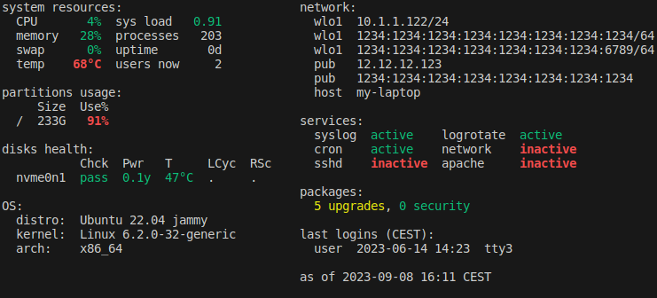

# motd Info

motd Info generates a dynamic motd via shell scripts.

It is easily configurable. Edit config.txt to change the layout. Edit the widgets to change their settings.

## Example

## Setup

1. copy this folder to `/usr/local/src/motd-info/`
2. create a symlink to the generate script in the `update-motd.d` directory:  
   `sudo ln -s /usr/local/src/motd-info/generate.sh /etc/update-motd.d/09-motd-info`
3. check what other motd scripts are in `/etc/update-motd.d/` and delete the unwanted ones (probably all)

## Development

- test in motd environment: `/usr/bin/env -i PATH=/usr/local/sbin:/usr/local/bin:/usr/sbin:/usr/bin:/sbin:/bin ./generate.sh`
  - actual motd environment is run as root
- execute all system motd scripts: `run-parts --lsbsysinit /etc/update-motd.d`
- execute all system motd scripts in motd environment: `/usr/bin/env -i PATH=/usr/local/sbin:/usr/local/bin:/usr/sbin:/usr/bin:/sbin:/bin run-parts --lsbsysinit /etc/update-motd.d`
  - actual motd environment is run as root
